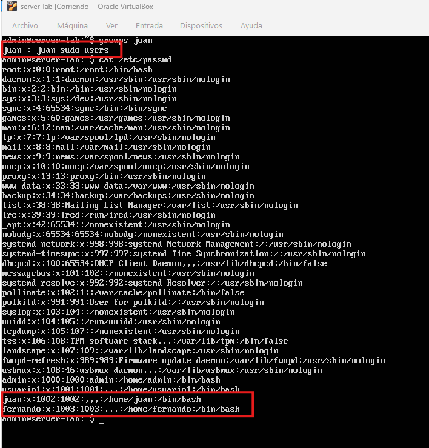
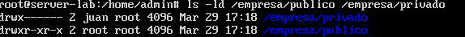
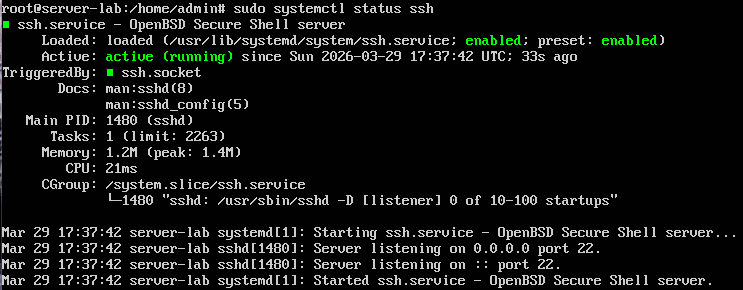
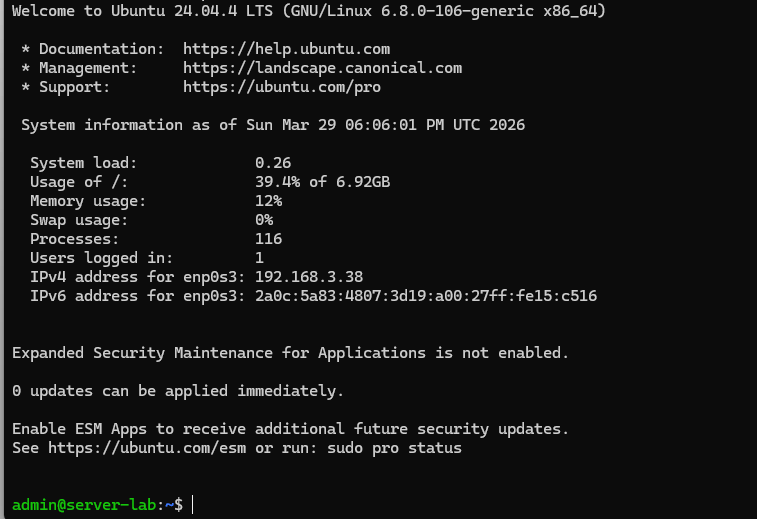
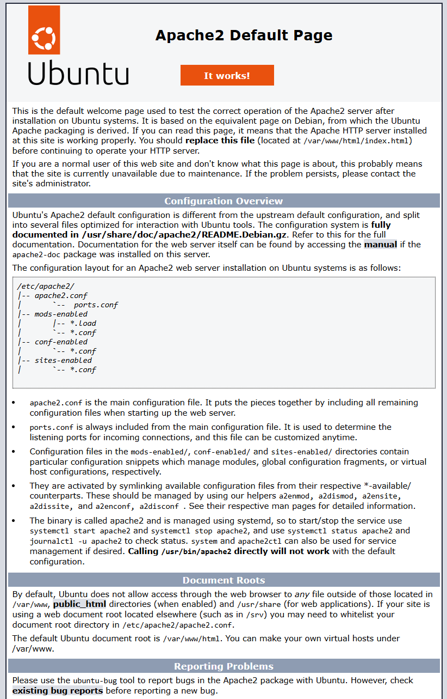

# Linux Server Lab

## Descripción

Laboratorio de administración de servidores Linux realizado en Ubuntu Server.
Se configuran usuarios, permisos, acceso remoto SSH, servidor web Apache, firewall y copias de seguridad.

---

## Objetivos

* Instalar y configurar un servidor Linux
* Gestionar usuarios y permisos
* Configurar acceso remoto SSH
* Instalar y configurar servidor web Apache
* Configurar firewall
* Realizar copias de seguridad
* Documentar el proceso

---

## Arquitectura del sistema

Servidor Ubuntu Server con:

* Acceso SSH
* Servidor web Apache
* Firewall UFW
* Sistema de copias de seguridad
* Gestión de usuarios y permisos

---

## Configuración

### Actualización del sistema

```
sudo apt update
sudo apt upgrade
```

### Creación de usuarios

```
sudo adduser juan
sudo adduser fernando
sudo usermod -aG sudo juan
```
con estos comandos creamos los dos usuarios y añadimos juan al grupo sudo para que obtenga
permisos de administrador.


### Permisos y directorios

```
mkdir /empresa
mkdir /empresa/publico
mkdir /empresa/privado
chmod 755 /empresa/publico
chmod 700 /empresa/privado
chown juan /empresa/privado
```
Aquí hemos realizado la creación de una estructura formada por la carpeta empresa y dentro dos 
subcarpetas una públucia que le hemos añadido permisos de control total sobre el propietario de la carpeta, lectura y entrada a la carpeta a los grupos e igual permisos para otros usuarios. A la otra subcarpeta llamada privada le hemos añadido control total para el propietario y hemos denegado el accesos a los grupos y otros usuarios. Por último con el último comando hemos hecho a juan dueño de la 
carpeta privado.


### SSH

```
sudo apt install openssh-server
sudo systemctl start ssh
sudo systemctl enable ssh
```
Con estos comandos instalamos y activamos un servidor ssh lo cual nos permitira controlar ubuntu server remotamente.
En esta captura se oberva que está activado correctamente

Aquí vemos una conexión realizada desde un terminal en windows hacia ubuntu-server

### Apache

```
sudo apt install apache2
sudo systemctl start apache2
```
Con estos comandos instalamos y activamos el servidor web apache2.
introduciendo la dirección ip de ubuntu-server en el navegador web se observa que apache2 está
funcionando correctamente.


### Firewall

```
sudo ufw allow ssh
sudo ufw allow 80
sudo ufw enable
```
Con estos comandos activamos el cortafuegos y añdimos los puertos ssh (22) y el puerto 80
para tráfico web.
Aquí se observa el cortafuegos funcionando y los puertos permitidos.

### Backup

```
tar -czvf backup.tar.gz /empresa
```

---

## Pruebas de funcionamiento

* Conexión SSH correcta
* Acceso al servidor web desde navegador
* Firewall activo
* Backup generado correctamente
* Permisos funcionando correctamente

---

## Comandos utilizados

* adduser
* chmod
* chown
* systemctl
* ufw
* tar
* apt

---

## Conclusiones

Este laboratorio permite practicar tareas básicas de administración de sistemas Linux como gestión de usuarios, permisos, servicios, seguridad y copias de seguridad.
