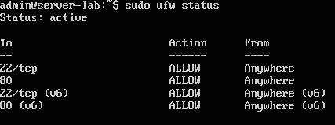
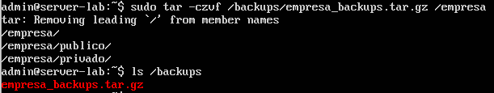

# Linux Server Lab

## Descripción

Laboratorio de administración de servidores Linux realizado en Ubuntu Server.
En este laboratorio se configuran usuarios, permisos, acceso remoto SSH, servidor web Apache, firewall UFW y copias de seguridad.

Este proyecto forma parte de mi portfolio de administración de sistemas y redes.

---

## Objetivos

* Instalar y configurar un servidor Linux
* Gestionar usuarios y permisos
* Configurar acceso remoto SSH
* Instalar y configurar servidor web Apache
* Configurar firewall
* Realizar copias de seguridad
* Documentar el proceso

---

## Arquitectura del sistema

Servidor Ubuntu Server configurado con:

* Acceso remoto mediante SSH
* Servidor web Apache
* Firewall UFW
* Sistema de copias de seguridad
* Gestión de usuarios y permisos

---

## Configuración

### Actualización del sistema

```
sudo apt update
sudo apt upgrade
```

### Creación de usuarios

```
sudo adduser juan
sudo adduser fernando
sudo usermod -aG sudo juan
```

Con estos comandos se crean dos usuarios y se añade el usuario **juan** al grupo sudo para otorgarle permisos de administrador.


---

### Permisos y directorios

```
mkdir /empresa
mkdir /empresa/publico
mkdir /empresa/privado
chmod 755 /empresa/publico
chmod 700 /empresa/privado
chown juan /empresa/privado
```

Se crea una estructura de directorios para la empresa con dos carpetas:

* **publico**: accesible por otros usuarios
* **privado**: acceso restringido únicamente al propietario

Se asignan permisos y se establece el usuario **juan** como propietario de la carpeta privada.


---

### SSH

```
sudo apt install openssh-server
sudo systemctl start ssh
sudo systemctl enable ssh
```

Se instala y activa el servicio SSH para permitir la administración remota del servidor.

Estado del servicio SSH:


Conexión SSH desde un equipo Windows al servidor Ubuntu:


---

### Apache

```
sudo apt install apache2
sudo systemctl start apache2
```

Se instala y activa el servidor web Apache.
Accediendo desde el navegador a la dirección IP del servidor se comprueba que el servicio web está funcionando correctamente.


---

### Firewall

```
sudo ufw allow ssh
sudo ufw allow 80
sudo ufw enable
```

Se activa el firewall UFW y se permiten los puertos:

* 22 (SSH)
* 80 (HTTP)

Estado del firewall:


---

### Backup

```
tar -czvf /backups/empresa_backup.tar.gz /empresa
```

Se crea una copia de seguridad comprimida de la carpeta **/empresa** en la carpeta **/backups**.



Para restaurar la copia de seguridad:

```
tar -xzvf /backups/empresa_backup.tar.gz -C /
```

---

## Pruebas de funcionamiento

* Conexión SSH correcta
* Acceso al servidor web desde navegador
* Firewall activo
* Backup generado correctamente
* Permisos funcionando correctamente

---

## Comandos utilizados

* adduser
* chmod
* chown
* systemctl
* ufw
* tar
* apt

---

## Conclusiones

En este laboratorio se han realizado tareas básicas de administración de sistemas Linux como gestión de usuarios, permisos, configuración de servicios, seguridad mediante firewall y copias de seguridad.
Este tipo de tareas son habituales en la administración de servidores Linux en entornos empresariales.
